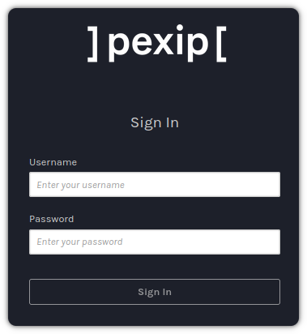
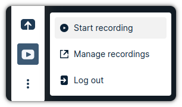
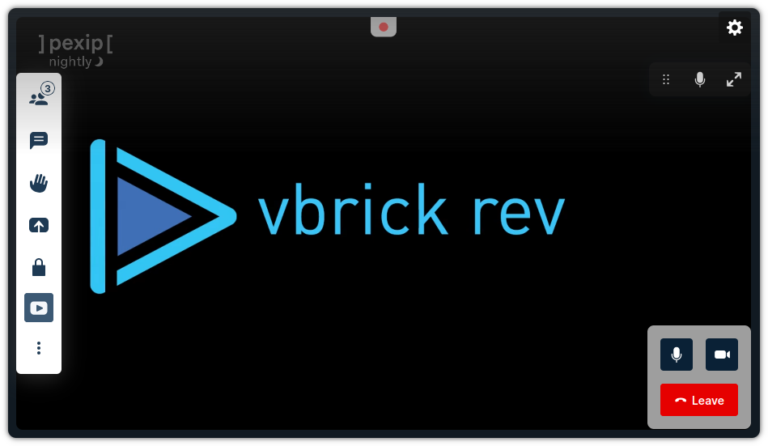

# Plugin: Recording for vBrick

This plugin allow the user to record the conference in the vBrick platform. Once
the user click on the recording button, Vbrick will join to the VMR as a SIP
participant and will record the call.

## How to use

The host user will see a new button in the toolbar and the first time that the
user click on it, the plugin will ask for the user to login.

<div align="center">


</div>

When the user click on that button, a dialog will appear to introduce the user
credentials:

<div align="center">



</div>

After the user introduce the credentials, the user will be able to start the
recording:

<div align="center">



</div>

When the user click on the recording button, the recording will start:

<div align="center">



</div>

## Plugin Configuration

You have to define a configuration file in `public/config.json`.

Here is an example of configuration:

```json
{
  "vbrick": {
    "url": "https://<vbrick-domain>",
    "client_id": "<vbrick-client-id>",
    "redirect_uri": "https://<pexip-domain>/<branding>/redirect"
  },
  "infinity": {
    "sip_domain": "<pexip-domain>"
  }
}
```

You have to define the following parameters under the `vbrick` section:

- **url:** The Vbrick environment to use.
- **client_id:** The key to access Vbrick.
- **redirect_uri:** Indicates where to redirect after a successful
  authentication. The domain of this URL take into account that we need to
  specify the same domain as the one used for our app and the branding.

In the `infinity` section we only have one parameter:

- **sip_domain:** Indicates the domain to use in the SIP URI to make the
  recording. Vbrick will establish call to
  `sip:<conference_alias>@<sip_domain>`.

You have to provision the `client_id` and `redirect_uri` into Vbrick.

1. Open Vbrick webpage. This is the same that you have to define in the url.
2. Go to `ADMIN > System Settings > API Keys`.
3. Click on `+ Add Key`.
4. Introduce the following parameters:

   - **name:** It's only a label to identify the key.
   - **key:** It's the value that we will use as `client_id`.
   - **authorized redirect uris:** Enter the `redirect_uri` that you want to
     use.

5. Click on `Create`.

## Pexip Infinity Configuration

In order to use this plugin, our Pexip deployment should comply with the
following requirements:

1. All the VMRs to record should contain a **SIP alias**. For example, if we
   have a VMR with alias `meet` in pexipdemo.com. We should also have another
   with the following format `meet@pexipdemo.com`.
2. You will need to configure the call routing to accept **SIP incoming**
   INVITES. Go to the Pexip Management node and create a new call routing
   (Services > Call Routing).

## Run the plugin

The first step is to download and compile all the dependencies:

```
npm install
```

Now we can launch the development server:

```
npm start
```

## Build the plugin

We can generate the `dist` folder with the build with the following command:

```
npm build
```
